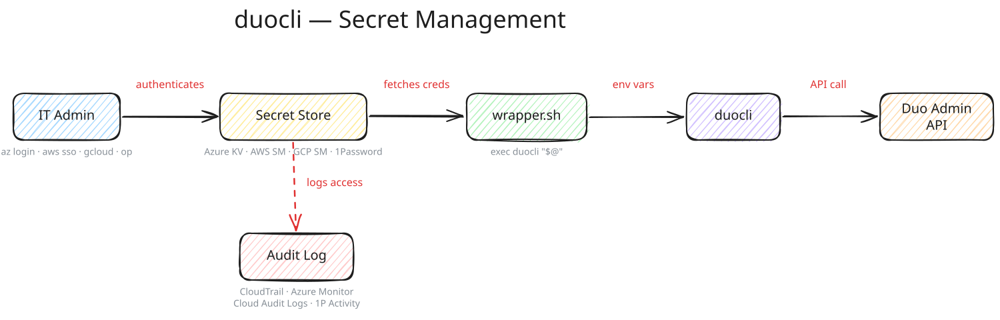

# duocli

CLI for managing Duo Security integrations via the Admin API. Create, inspect, update, and delete applications. Pull authentication logs, admin activity, and trust monitor alerts. Human-readable tables or JSON output.

## Quick Start

```bash
# Clone and set credentials
git clone https://github.com/blanxlait/duocli.git
cd duocli
cp .env.example .env   # edit with your Duo Admin API credentials

# Run (no install needed — uv handles it)
uv run duo --human list-apps
uv run duo --human info-summary
uv run duo --human auth-logs --since 7d
```

### Prerequisites

- Python 3.9+
- [uv](https://docs.astral.sh/uv/) package manager
- Duo Admin API credentials ([Duo Admin Panel](https://admin.duosecurity.com) → Applications → Admin API)

### Credentials

Set three environment variables (via `.env` file or `export`):

```bash
DUO_IKEY=your_integration_key    # starts with DI
DUO_SKEY=your_secret_key
DUO_HOST=api-XXXXXXXX.duosecurity.com
```

## Commands

### Application Management

```bash
uv run duo --human list-apps                              # List all integrations
uv run duo --human get-app --ikey DIXXXXXXXXXXXXXXXXXX    # Inspect one app
uv run duo create-app --name "My App" --type websdk       # Create an app
uv run duo update-app --ikey DIXXX --json '{"name":"New"}' # Update an app
uv run duo delete-app --ikey DIXXXXXXXXXXXXXXXXXX          # Delete an app
```

### Logs & Audit

```bash
uv run duo --human auth-logs --since 7d            # Authentication events
uv run duo --human admin-logs --since 7d           # Admin actions
uv run duo --human activity-logs --since 24h       # Detailed activity
uv run duo --human trust-monitor --since 7d        # Trust Monitor alerts
uv run duo --human auth-stats --since 30d          # Auth attempt counts
```

### Account & Policies

```bash
uv run duo --human info-summary                    # User/admin/app counts
uv run duo --human list-policies                   # All policies
uv run duo --human get-policy --id POLICYKEY123    # Specific policy
```

### Utility

```bash
uv run duo schema create-app                       # Show command parameters
uv run duo --version                               # Show version
```

## Output Modes

**JSON** (default) — machine-readable, pipes to `jq`:
```bash
uv run duo list-apps | jq '.[].name'
```

**Human** — readable tables with `--human` (before the subcommand):
```bash
uv run duo --human list-apps
```

**Field filtering** — narrow columns with `--fields`:
```bash
uv run duo --human list-apps --fields name,type,integration_key
```

**Dry-run** — preview without calling the API:
```bash
uv run duo create-app --name "Test" --type websdk --dry-run
```

## Secret Management

Duo Admin API credentials are tenant-scoped (not per-user), so the secret store becomes your audit layer — whoever accessed the credentials is whoever ran the command.



Each template includes infrastructure-as-code setup and a wrapper script that fetches credentials at runtime:

| Template | IaC | Audit Trail |
|----------|-----|-------------|
| [Azure Key Vault](templates/azure-keyvault/) | Bicep | Azure Monitor |
| [AWS Secrets Manager](templates/aws-secrets-manager/) | CDK (TypeScript) | CloudTrail |
| [GCP Secret Manager](templates/gcp-secret-manager/) | Terraform | Cloud Audit Logs |
| [1Password](templates/1password/) | op CLI | Activity Log |

### How it works

1. IT admin authenticates to their secret store (`az login`, `aws sso login`, `gcloud auth`, `op signin`)
2. Wrapper script fetches Duo credentials and exports them as env vars
3. `exec duocli "$@"` runs the command with credentials in scope
4. Secret store logs who accessed the credentials and when

## Testing

```bash
uv run pytest tests/ -v              # Full suite (98 tests)
uv run pytest tests/test_cli.py -v   # CLI tests only
uv run pytest tests/test_cli.py -k "auth_logs" -v  # Single command
```

## Architecture

```
src/duocli/
├── cli.py              # Click CLI group + 14 commands
├── output.py           # JSON and human-readable formatters
├── validate.py         # Input validation (ikey, name, type)
└── backends/
    ├── __init__.py     # get_backend() factory — selects by env vars
    ├── base.py         # DuoBackend abstract base class
    ├── direct.py       # DirectBackend — wraps duo_client.Admin
    └── broker.py       # BrokerBackend — Phase 2 stub

templates/              # Secret store IaC templates
    ├── azure-keyvault/
    ├── aws-secrets-manager/
    ├── gcp-secret-manager/
    └── 1password/
```

**Backend pattern**: `DuoBackend` ABC defines all operations. `DirectBackend` wraps the Duo SDK, catches `RuntimeError`, and returns normalized flat dicts. `BrokerBackend` is a Phase 2 stub for accountable API access via a proxy.

**CLI pattern**: validate → dry-run → get backend → call → error check → format output.

**Exit codes**: `0` success, `1` input/validation error, `2` API error.

## Contributing

```bash
# Set up dev environment
git clone https://github.com/blanxlait/duocli.git
cd duocli
uv venv && source .venv/bin/activate
uv pip install -e .

# Run tests before committing
uv run pytest tests/ -v
```

To add a new command, see [CLAUDE.md](CLAUDE.md#adding-a-new-command) or use the `/new-command` Claude Code skill.

## MCP Server

duocli includes a read-only [MCP server](https://modelcontextprotocol.io/) that lets AI assistants query your Duo tenant directly. Available tools: `list_apps`, `get_app`, `info_summary`, `auth_logs`, `admin_logs`, `auth_stats`, `list_policies`.

### Claude Code

Already configured — the `.mcp.json` in this repo auto-connects. Just open the project and the `mcp__duocli__*` tools are available.

### Claude Desktop

Add to `~/Library/Application Support/Claude/claude_desktop_config.json`:

```json
{
  "mcpServers": {
    "duocli": {
      "command": "uv",
      "args": ["run", "python", "-m", "duocli.mcp_server"],
      "cwd": "/path/to/duocli",
      "env": {
        "DUO_IKEY": "your_integration_key",
        "DUO_SKEY": "your_secret_key",
        "DUO_HOST": "api-XXXXXXXX.duosecurity.com"
      }
    }
  }
}
```

### ChatGPT (Developer Mode)

ChatGPT requires an HTTP/SSE server (not stdio). Run the MCP server in SSE mode:

```bash
# Start the server on port 8080
cd /path/to/duocli
uv run fastmcp run src/duocli/mcp_server.py --transport sse --port 8080
```

Then in ChatGPT:

1. Enable **Developer Mode** (Settings → Apps & Connectors → Advanced Settings)
2. Click **Create app**
3. Enter the server URL: `http://localhost:8080/sse`
4. Set authentication to **None** (credentials are in the server's env vars)
5. Select the tools you want to enable

> **Note**: ChatGPT must be able to reach the server URL. For local development, the server and ChatGPT Desktop must be on the same machine. For remote access, deploy behind a reverse proxy with authentication.

### Other MCP Clients (VS Code, Cursor, Windsurf)

Use the same stdio config as Claude Desktop — add to your client's MCP settings:

```json
{
  "command": "uv",
  "args": ["run", "python", "-m", "duocli.mcp_server"],
  "cwd": "/path/to/duocli"
}
```

## Claude Code Skills

This repo ships with [Claude Code](https://docs.anthropic.com/en/docs/claude-code) skills in `.claude/` that activate automatically when you work in this project:

| Skill | Trigger | What it does |
|-------|---------|-------------|
| `duo-audit` | "who logged in", "check auth logs" | Guides investigation of auth logs, admin activity, trust monitor |
| `duo-apps` | "create an app", "list integrations" | Walks through app CRUD operations |
| `duo-health` | "account summary", "check policies" | Runs health checks and policy reviews |
| `/new-command` | User-invoked | Scaffolds a new CLI command end-to-end |
| `/test-command` | User-invoked | Runs tests for a specific command by name |

Hooks auto-run `pytest` on Python file edits and block accidental `.env` modifications. A `security-reviewer` agent is available for reviewing credential handling changes.

## License

MIT
